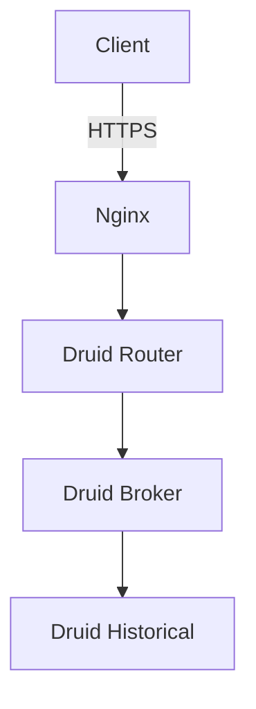

# Documentation Guidelines

## Markdown Standards

### File Naming
- Use lowercase with hyphens: `deployment-guide.md`
- Be descriptive: prefer `ssl-certificate-setup.md` over `ssl.md`
- Place in appropriate directory: `/docs/` for comprehensive guides
- Keep README.md files in each major directory

### Structure
- Start with a clear H1 title
- Include table of contents for documents > 200 lines
- Use consistent heading hierarchy (don't skip levels)
- End with related links or next steps section

### Formatting
- Use fenced code blocks with language specifiers:
  ````markdown
  ```bash
  docker-compose up -d
  ```
  ````
- Use tables for structured data
- Include badges for status indicators
- Use blockquotes for important notes:
  ```markdown
  > **Note:** This is an important callout
  ```

## README Best Practices

### Repository Root README.md
- Project overview with badges
- Feature highlights
- Architecture diagram
- Quick start guide
- Prerequisites and requirements
- Links to detailed documentation
- Contributing guidelines
- License information

### Directory README.md
- Purpose of the directory
- File organization explanation
- Setup or usage instructions specific to that component
- Configuration details
- Common issues and solutions
- Links to related documentation

## Documentation Types

### Quick Start Guides
- Assume minimal context
- Provide copy-paste commands
- Include common gotchas
- Link to comprehensive documentation
- Test all commands before documenting

### Configuration Guides
- Document all available options
- Provide examples for common scenarios
- Explain default values
- Include security considerations
- Show environment-specific configurations

### Troubleshooting Guides
- Organize by symptom, not cause
- Include exact error messages
- Provide step-by-step resolution
- Explain why the solution works
- Include prevention tips

### API Documentation
- Document all endpoints/functions
- Include request/response examples
- Specify required vs optional parameters
- Document error codes and messages
- Provide authentication details

## Code Examples

### Commands
- Show full command with all necessary flags
- Include output examples when helpful
- Explain what each flag does
- Provide alternative approaches when applicable

### Example
```bash
# Deploy to production with verbose logging
./scripts/deploy.sh prod --verbose

# Output:
# [2024-01-15 10:30:00] Starting production deployment...
# [2024-01-15 10:30:05] Pulling latest images...
# [2024-01-15 10:30:30] Starting services...
```

### Configuration Files
- Show complete, working examples
- Highlight values that need customization
- Explain each section's purpose
- Include comments in the example

## Environment Variables Documentation

Document environment variables in this format:

| Variable | Required | Default | Description |
|----------|----------|---------|-------------|
| `POSTGRES_USER` | Yes | `druid` | PostgreSQL username for Druid metadata |
| `POSTGRES_PASSWORD` | Yes | - | PostgreSQL password (change in production) |
| `NGINX_HTTP_PORT` | No | `80` | HTTP port for Nginx |

## Architecture Diagrams

### When to Include
- Initial setup documentation
- System overview
- Network topology explanations
- Service interaction flows

### Format
- Use ASCII art for simple diagrams (stays in version control)
- Use Mermaid for complex diagrams (renders in GitHub)
- Include legend for symbols/arrows
- Keep diagrams up-to-date with changes

### Example Mermaid
````markdown

````

## Links and References

### Internal Links
- Use relative paths from repository root
- Check links still work after moving files
- Prefer links to sections within same file: `[Section](#section-name)`

### External Links
- Use descriptive link text (not "click here")
- Link to stable, versioned documentation when available
- Include context for why the link is relevant
- Check links periodically for dead links

## Version-Specific Documentation

### When Documenting Version-Specific Features
- Clearly state which version the documentation applies to
- Update documentation when upgrading dependencies
- Keep migration guides for major version changes
- Archive old documentation rather than deleting

### Example
```markdown
## PostgreSQL Setup (v15+)

For PostgreSQL 15 and later, use the following configuration...

### Upgrading from PostgreSQL 14
See [migration guide](docs/postgres-14-to-15-migration.md)
```

## Security Documentation

### What to Document
- Authentication and authorization mechanisms
- SSL/TLS configuration
- Secrets management approach
- Security best practices
- Known vulnerabilities and mitigations

### What NOT to Document
- Actual passwords, API keys, or tokens
- Internal IP addresses (use placeholders)
- Private keys or certificates
- Security vulnerabilities not yet patched

### Use Placeholders
```markdown
# Bad
export API_KEY="sk-1234567890abcdef"

# Good
export API_KEY="your-api-key-here"
```

## Maintenance

### Regular Updates
- Review documentation quarterly
- Test all commands still work
- Update screenshots if UI changed
- Verify external links still work
- Update version numbers

### When Code Changes
- Update affected documentation immediately
- Review related documentation for consistency
- Add migration notes if breaking changes
- Update examples to reflect new best practices

### Documentation Changes in PRs
- Include documentation updates in the same PR as code changes
- Highlight documentation changes in PR description
- Request documentation review from maintainers
- Update changelog with doc improvements

## Common Documentation Patterns

### Prerequisites Section
```markdown
## Prerequisites

Before you begin, ensure you have:
- Docker 24.0 or higher installed
- Docker Compose 2.0 or higher installed
- At least 8GB RAM available
- A registered domain name (for production)
```

### Installation Section
```markdown
## Installation

1. Clone the repository:
   ```bash
   git clone https://github.com/user/repo.git
   cd repo
   ```

2. Copy and configure environment variables:
   ```bash
   cp .env.example .env
   nano .env  # Edit as needed
   ```

3. Start the services:
   ```bash
   docker-compose up -d
   ```
```

### Troubleshooting Section
```markdown
## Troubleshooting

### Service won't start

**Symptom**: Service exits immediately after starting

**Solution**:
1. Check logs: `docker-compose logs service-name`
2. Verify environment variables are set
3. Check for port conflicts

**Prevention**: Always run health checks after deployment
```

## Accessibility

### Making Documentation Accessible
- Use descriptive link text
- Include alt text for images and diagrams
- Use semantic heading structure
- Ensure code examples are properly formatted
- Test with screen readers when possible
- Use high contrast colors in diagrams

## Localization Considerations

### If Adding Multi-Language Support
- Use clear, simple English in base documentation
- Avoid idioms and colloquialisms
- Keep sentences short and focused
- Use consistent terminology
- Structure documentation for easy translation

## Quality Checklist

Before submitting documentation changes:

- [ ] Spell check completed
- [ ] Grammar reviewed
- [ ] All commands tested
- [ ] Code examples work as shown
- [ ] Links verified (internal and external)
- [ ] Screenshots current (if applicable)
- [ ] Consistent with existing documentation style
- [ ] No sensitive information included
- [ ] Appropriate heading hierarchy used
- [ ] Table of contents updated (if needed)
